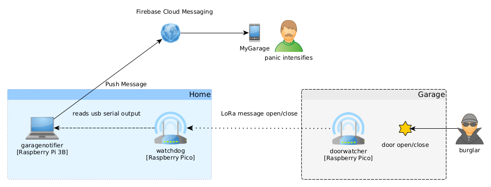

GarageAlarm
===========

GarageAlarm can detect whether the garage door is open or closed.
The garage that I rent is about 500-1000 meters from the apartment,
it would be nice to know if I closed the door..., How Hard Can It Be?




**doorwatcher**

A component built with a Raspberry Pico and infra sensor and a LoRa module.
The infra sensor is used to detect whether the door is open or closed.
To save battery the Pico is mostly in dormant mode (deep sleep), it wakes up
when the infra sensor's output changes, then sends an open/close message with LoRa.
I power this component with 3x AA batteries.


**watchdog**

A component built with a Raspberry Pico and a LoRa module. It receives LoRa packets
and print some action words when the doorwatcher sends a message.


**notifier**

It runs on a Raspberry Pi 3B, the watchdog is connected to this Pi using an USB cable.
It reads the watchdog's log and creates Firebase Push Notifications when something happens.
Internet access is needed here.


**app**

An android application that receives the notifications, shows them to the user,
and keeps track of the door state as there is no server in this architecture.

Set the notifications to Alerting mode in the Android <a href="https://support.google.com/android/answer/9079661?hl=en#zippy=%2Cchoose-if-notifications-interrupt-you-or-stay-silent">Settings</a> application.

Communication
-------------

<a href="https://lora-developers.semtech.com/documentation/tech-papers-and-guides/lora-and-lorawan/">LoRa</a> is an RF
modulation technology for low-power, wide area networks. LoRa is purely a physical (PHY), or “bits”
layer implementation, as defined by the OSI seven-layer Network Mode.

Notice that this project uses **LoRa** as "peer to peer" communication and not **LoRaWAN**.

**Protocol**
```
struct Packet {
  uint8_t header{0x42};
  uint8_t iv[16]{};
  std::string payload{};
};
```

The packets are **encrypted** using AES-128 CTR. The AES key must be kept as secret! The keys are installed, preshared on
the devices. The initialization vector (IV) is sent unencrypted in the packet, the same IV key pair should be used
only at once.

**IV** 
```
IV 16 byte [ xx xx xx xx xx xx xx xx cc cc cc cc cc cc cc cc ]
  xx xx xx xx xx xx xx xx : Random 8 byte is gathered using LoRa Wideband RSSSI when the device starts, not changed while live. [iv_top]
  cc cc cc cc cc cc cc cc : A 8 byte counter that is incremented at every message. [iv_bottom]
```

Non repudiation is as is, since the communication is not duplex. The watchdog (receiver) will save the iv_top at the
first message and will ignore other messages with different iv_tops. The iv_bottom is also checked: it must be bigger than
the previously received. The payloads are fixed here (either "open" or "close"), so it can be checked for validity.


Idea, if communication were duplex:

A -> B: Hey! [random_A1]
B -> A: Sup? [random_A1, random_B1]
A -> B: This is what! [random_B1]

Then Non repudiation, Confidentiality, Authentication are all checked as long the keys are only known between A&B. Data Integrity GCM or some MAC?
(Correct me if I'm wrong here.)


Hardware
--------

 - 2x Raspberry Pico
 - 2x RFM95W LoRa module
 - 1x Infra Sensor HW-201A


**Pin Layouts**


| Raspberry Pi Pico | Semtech SX1278 |
| ----------------- | -------------- |
| 3.3V | VCC |
| GND | GND |
| GPIO 18 | SCK |
| GPIO 19 | MOSI |
| GPIO 16 | MISO |
| GPIO 7 | DIO0 / G0 |
| GPIO 8 | NSS / CS |
| GPIO 9 | RESET |
| GPIO 10 | DIO1 / G1 |


| Raspberry Pi Pico | Infra Sensor HW-201A |
| ----------------- | -------------------- |
| 3.3V | VCC |
| GND | GND |
| GPIO 22 | OUT |


Building
--------

**doorwatcher**, **watchdog**

Setup your pico build environemnt then:
```
mkdir build && cd build
cmake ..
make
# copy the the uf2 files to your picos
```

**notifier**

Check the README.

**app**

Create a Firebase project add an android application with the proper package names (probably it should be changed).
Then download the **google-services.json** to app/app directory from your Firebase console.
Build the project with Android Studio.


Developing workflow tips with a Raspberry Pi 3B

```
ssh pi@RASPBERRY_IP

# use sshfs to mount the project on the pi
mkdir -p /home/pi/pico/garagealarm
sshfs youruser@HOST_IP:/home/tomi/qt_workspace/pico/garagealarm /home/pi/pico/garagealarm

cd ~/pico/garagealarm

mkdir build && cd build
cmake -DCMAKE_BUILD_TYPE=Debug ..

make doorwatcher
openocd -f interface/raspberrypi-swd.cfg -f target/rp2040.cfg -c "program doorwatcher/doorwatcher.elf verify reset exit"

minicom -b 115200 -o -D /dev/serial0 # for uart
minicom -b 115200 -o -D /dev/ttyACM0 # for usb
```
