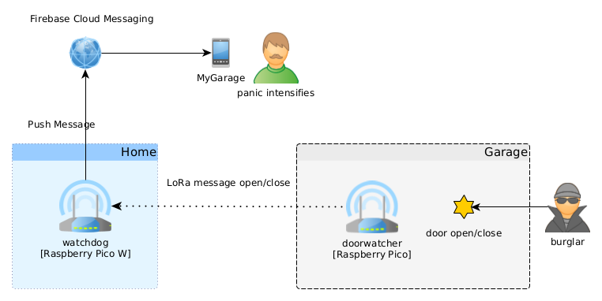

GarageAlarm
===========

GarageAlarm can detect whether the garage door is open or closed.
The garage that I rent is about 320 meters from the apartment,
it would be nice to know if I closed the door..., How Hard Can It Be?


<a href="https://docs.google.com/presentation/d/1tIYUefcGcdnDLyIjWLCoXbDT66C93z82hiz6jU8Zyz8">Veszprem Technology Meetup Slides with Pictures and useful Links</a>


## Variant A
  * 2x Raspberry Pico
  * 1x Raspberry Pi 3 or something with Internet Connection


## Variant B
  * 1x Raspberry Pico
  * 1x Raspberry Pico W



## doorwatcher

A component built with a Raspberry Pico, a magnetic sensor and a LoRa module.
The magnetic reed switch is used to detect whether the door is open or closed.
To save battery the Pico is mostly in dormant mode (deep sleep), it wakes up
when the magnetic switch changes, sends an open_/close message using LoRa.
Powered by 3x AA batteries.


## watchdog

### Variant A

A component built with a Raspberry Pico and a LoRa module. It receives LoRa packets
and prints action words to the USB serial, e.g.: #ACTION_DOOR_OPEN#.

### Variant B

A component built with a Raspberry Pico W and a LoRa module. It receives LoRa packets
and and sends Firebase Push Messages. The lwIP stack with Mbed-TLS is used to send
HTTP request to fcm.googleapis.com. OAuth2, DNS lookup and NTP time synchronization is implemented
too.


## notifier

It runs on a Raspberry Pi 3B, the watchdog is connected to this Pi using an USB cable.
It reads the watchdog's log and creates Firebase Push Notifications when something happens.
Internet access is needed here.


## app

An android application that receives the notifications, shows them to the user,
and keeps track of the door state as there is no server in this architecture.

NOTE: set the notifications to Alerting mode in the Android <a href="https://support.google.com/android/answer/9079661?hl=en#zippy=%2Cchoose-if-notifications-interrupt-you-or-stay-silent">Settings</a> application.

# Communication

<a href="https://lora-developers.semtech.com/documentation/tech-papers-and-guides/lora-and-lorawan/">LoRa</a> is an RF
modulation technology for low-power, wide area networks. LoRa is purely a physical (PHY), or “bits”
layer implementation, as defined by the OSI seven-layer Network Mode.

Notice that this project uses **LoRa** as "peer to peer" communication and not **LoRaWAN**.

## Protocol
```cpp
struct Packet {
  uint8_t header{0x42};
  uint8_t iv[16]{};
  std::string payload{};
};
```

The payload is **encrypted** using AES-128/CTR. The AES key must be kept as secret! The key is known only by
the sender and receiver. The initialization vector (IV) is sent unencrypted in the packet, the same IV and key pair must be used
only once.

**IV** 
```
IV 16 byte [ xx xx xx xx xx xx xx xx cc cc cc cc cc cc cc cc ]
  xx xx xx xx xx xx xx xx : Random 8 byte is gathered using LoRa Wideband RSSI when the device starts, not changed while live. [iv_top]
  cc cc cc cc cc cc cc cc : A 8 byte counter that is incremented at every message. [iv_bottom]
```

Example: open_
```
000000: 42 08 07 16 0e 0f 07 0f 05 00 00 00 00 00 00 00  B...............
000010: c0 64 25 66 cb 25                                .d%f.%
```

Example: close
```
000000: 42 08 07 16 0e 0f 07 0f 05 00 00 00 00 00 00 00  B...............
000010: c1 d3 d6 92 c1 22                                ....."
```

### Security properties
 - **Non repudiation:** No, the receiver has the key, so it can forge any message.
 - **Data Integrity:** ?Yes?, old messages can’t be played back as long as the receiver is not restarted, message loss could be detected.
 - **Authentication:** ?Yes?, as long as the receiver is not restarted, and sender is verified manually at the first message.
 - **Confidentiality:** Yes, as the key is only known to receiver and sender, but it’s either close or open_ alternately...

Non repetition is as is, since the communication is not duplex. The watchdog (receiver) saves the iv_top at the
first message and ignores other messages with different iv_tops. The iv_bottom is also checked: it must be bigger than
the previously received. The payloads are fixed here (either "open_" or "close"), so it can be checked for validity.


Idea, if communication were duplex (AES-128/GCM):

 1. A -> B: Hey! [random_A1]
 2. B -> A: Sup? [random_A1, random_B1]
 3. A -> B: This is what! [random_B1]


# Hardware

 - 2x Raspberry Pico
 - 2x RFM95W LoRa module 868 MHz / 2x RA02-LORA-SX1278 module 433 MHz
 - 1x Magnetic Reed Switch MC-38W Normally Closed


**Pin Layouts**


| Raspberry Pi Pico | Semtech SX1278 |
| ----------------- | -------------- |
| 3.3V | VCC |
| GND | GND |
| GPIO 18 | SCK |
| GPIO 19 | MOSI |
| GPIO 16 | MISO |
| GPIO 7 | DIO0 / G0 |
| GPIO 8 | NSS / CS |
| GPIO 9 | RESET |
| GPIO 10 | DIO1 / G1 |


| Raspberry Pi Pico | Magnetic Switch MC-38W |
| ----------------- | ---------------------- |
| GND | GND |
| GPIO 22 | OUT |


# Building

```bash
git submodule init
git submodule update
```

## doorwatcher, watchdog

Setup your pico build environemnt then:
```bash
# Variant A
mkdir build && cd build && cmake .. && make
# Then copy the uf2 files to your picos

# Variant B
cp watchdog/watchdog-config.h.example watchdog/watchdog-config.h # edit the config file
mkdir build && cd build && cmake -DPICO_BOARD=pico_w .. && make
# Then copy the  watchdog.uf2 file to your pico w
```

## notifier

Check the README.

## app

Create a Firebase project add an android application with the proper package names (probably it should be changed).
Then download the **google-services.json** to app/app directory from your Firebase console.
Build the project with Android Studio.


### Developer workflow tips with a Raspberry Pi 3B

```bash
ssh pi@RASPBERRY_IP

# use sshfs to mount the project on the pi
mkdir -p /home/pi/pico/garagealarm
sshfs youruser@HOST_IP:/home/tomi/qt_workspace/pico/garagealarm /home/pi/pico/garagealarm

cd ~/pico/garagealarm

mkdir build && cd build
cmake -DCMAKE_BUILD_TYPE=Debug ..

make doorwatcher
openocd -f interface/raspberrypi-swd.cfg -f target/rp2040.cfg -c "program doorwatcher/doorwatcher.elf verify reset exit"

minicom -b 115200 -o -D /dev/serial0 # for uart
minicom -b 115200 -o -D /dev/ttyACM0 # for usb
```
